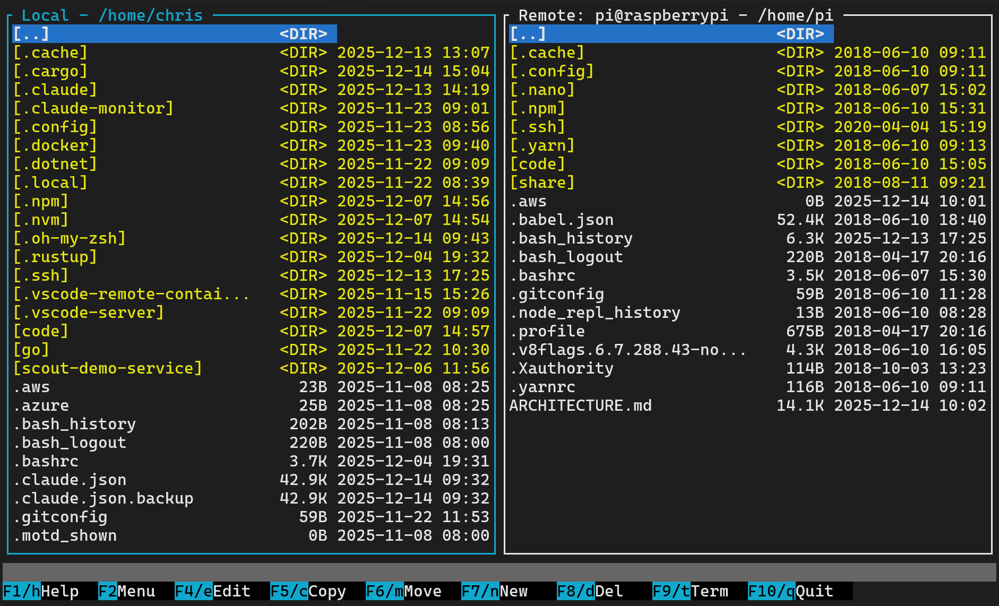

# Remote Commander

A Norton Commander-style dual-pane file manager for the terminal, built in Rust. Navigate local and remote filesystems side-by-side with keyboard-driven controls.




## Features

- **Dual-pane interface** — Classic Norton Commander layout with local filesystem on the left and remote (SSH) on the right
- **Keyboard-driven navigation** — Arrow keys, Page Up/Down, Home/End for fast file browsing
- **Function key commands** — F1-F10 shortcuts for common operations (view, edit, copy, move, delete)
- **Alternative keybindings** — Letter shortcuts (c, m, d, etc.) for terminals that intercept function keys
- **SSH remote browsing** — Connect to remote hosts via SFTP and browse files seamlessly
- **Flexible authentication** — Supports SSH agent, key files (~/.ssh/id_ed25519, id_rsa, etc.), and password fallback
- **Cross-panel operations** — Copy and move files between local and remote systems with full SFTP support

## Installation

### From Source

```bash
git clone https://github.com/yourusername/remote-commander.git
cd remote-commander
cargo build --release
```

The binary will be available at `target/release/remote-commander`.

## Usage

```bash
# Launch with local filesystem on both panels
remote-commander

# Connect to a remote host (SSH)
remote-commander user@hostname

# Connect with a custom port
remote-commander user@hostname:2222
```

## SSH Authentication

Remote Commander attempts authentication in the following order:

1. **SSH Agent** — Uses keys loaded in your SSH agent (ssh-agent, gpg-agent, etc.)
2. **SSH Key Files** — Tries common key files in `~/.ssh/`:
   - `id_ed25519`
   - `id_rsa`
   - `id_ecdsa`
   - `id_dsa`
3. **Password** — Falls back to password prompt if keys are unavailable or fail

## Keyboard Shortcuts

### Navigation

| Key | Action |
|-----|--------|
| `↑` / `↓` | Move selection up/down |
| `Page Up` / `Page Down` | Move one page up/down |
| `Home` / `End` | Jump to first/last item |
| `Enter` | Enter directory |
| `Backspace` | Go to parent directory |
| `Tab` | Switch between panels |

### Function Keys

| Key | Alternative | Action |
|-----|-------------|--------|
| `F1` | `h` | Help |
| `F2` | — | Menu |
| `F3` | `v` | View file |
| `F4` | `e` | Edit file |
| `F5` | `c` | Copy file to opposite panel |
| `F6` | `m` | Move file to opposite panel |
| `F7` | `n` | Make directory |
| `F8` | `d` | Delete file/directory |
| `F9` | — | Terminal |
| `F10` / `q` | — | Quit |

**Note:** Alternative letter keys are provided for terminals (like Windows Terminal) that intercept function keys.

## Project Structure

```
src/
├── main.rs        # Entry point, CLI parsing, event loop
├── app.rs         # Application state and command handlers
├── file_panel.rs  # Panel logic (selection, scrolling, navigation)
├── filesystem.rs  # Filesystem abstraction (local/remote)
├── ssh.rs         # SSH connection and remote filesystem (SFTP)
└── ui.rs          # Terminal UI rendering with Ratatui
```

## Dependencies

- [Ratatui](https://ratatui.rs/) — Terminal UI framework
- [Crossterm](https://github.com/crossterm-rs/crossterm) — Cross-platform terminal manipulation
- [Clap](https://clap.rs/) — Command-line argument parsing
- [ssh2](https://github.com/alexcrichton/ssh2-rs) — SSH/SFTP client library (libssh2 bindings)
- [rpassword](https://github.com/conradkleinespel/rpassword) — Secure password input

## Development

```bash
# Run tests
cargo test

# Run with debug output
RUST_LOG=debug cargo run

# Build release version
cargo build --release
```

## Roadmap

- [x] Dual-pane local filesystem navigation
- [x] Function key bar with alternative letter shortcuts
- [x] Help popup
- [x] SSH remote filesystem browsing (SFTP)
- [x] SSH agent authentication
- [x] SSH key file authentication
- [x] Password authentication fallback
- [x] File copy operations (local ↔ local, local ↔ remote, remote ↔ remote)
- [x] File move operations (copy + delete source)
- [x] File/directory deletion (F8/d)
- [ ] Directory copy/move operations (recursive)
- [ ] File viewing (F3/v)
- [ ] File editing with external editor (F4/e)
- [ ] Directory creation (F7/n)
- [ ] File search
- [ ] Bookmarks

## License

MIT License — see [LICENSE](LICENSE) for details.

## Contributing

Contributions are welcome! Please open an issue or submit a pull request.
